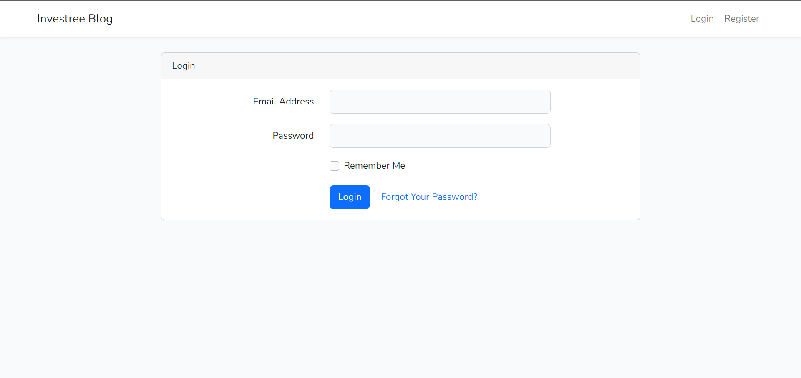

<p align="center"><a href="https://laravel.com" target="_blank"></a></p>

<p align="center">
<a href="https://travis-ci.org/laravel/framework"></a>
<a href="https://packagist.org/packages/laravel/framework"></a>
<a href="https://packagist.org/packages/laravel/framework"></a>
<a href="https://packagist.org/packages/laravel/framework"></a>
</p>

## About This Project




This project was created for the [Rakamin Academy Virtual Internship Program](https://www.rakamin.com/virtual-internship-experience/investree-fullstack-developer). The program consisted of 4 weeks of video-based and text-based material covering web programming with PHP as well as Laravel concepts such as Eloquent, Passport, and Laravel UI.

## Versions Used

- Node.js v16.14.0
- Composer v2.3.19
- Laravel v9.26.1
- PHP v8.1.6

## Prerequisites

- **[Xampp (PHP, MySQL Server, and more)](https://www.apachefriends.org/download.html)**
- **[Node.js v16.14.0^](https://nodejs.dev/en/download/)**
- **[Composer v2.3.10^](https://getcomposer.org/download/)**

# Project Setup

## Composer Dependency Installation

```
composer install
```

## Setup Environment Variables
Edit the environment variables on `.env` to suit your system, such as the database configuration and host name.
```
cp .env.example .env
```
```
# Edit these
DB_CONNECTION=
DB_HOST=
DB_PORT=
DB_DATABASE=
DB_USERNAME=
DB_PASSWORD=
```

## Populate Database
Make sure to run your MySQL server before populating database
```
php artisan key:generate
php artisan migrate --seed
php artisan passport:install
```

## Generate Front End and Public Files (via Webpack)
```
npm install && npm run dev
```


## Run Laravel Server
```
php artisan serve --port=8000
```
